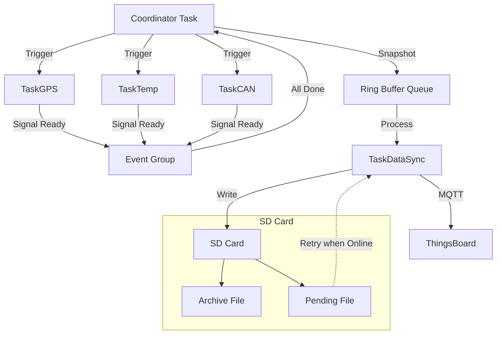

# Engineering Thesis - GPS & CAN Data Collection System

## Project Overview

This is an ESP32-based data acquisition system designed for an engineering thesis. The system collects telemetry data from multiple sources including GPS (NMEA), Temperature (DS18B20), and CAN bus (via TWAI). Data is transmitted to the ThingsBoard IoT platform via MQTT over Wi-Fi and simultaneously logged to an SD card for offline retrieval.

 The system is designed with a coordinator-driven architecture using FreeRTOS to ensure synchronized data snapshots.

## System Architecture

### Main Components

1.  **main.ino**: Entry point handling FreeRTOS task creation, hardware setup, and the central Coordinator logic.
2.  **GpsModule**: Wrapper for `TinyGPSPlus`, handles UART communication with the GPS receiver.
3.  **CanModule**: Manages the ESP32 Two-Wire Automotive Interface (TWAI) to read speed data from the vehicle's CAN bus.
4.  **SdModule**: Manages logging data to SD card in JSON Lines format (`.jsonl`), including an "offline pending" queue for later transmission.
5.  **ThingsBoardClient**: Handles MQTT connection, telemetry data upload, and attribute synchronization (e.g., changing sampling intervals remotely).
6.  **TimeManager**: Maintains high-precision system time, synchronized via GPS PPS (Pulse Per Second) or optional NTP/WiFi fallback.
7.  **WebServerModule**: Provides a local web interface for system status/map visualization (runs on port 80).
8.  **WiFiManager**: Handles Wi-Fi connection logic, manages a list of known networks (SSID/Password), and handles automatic reconnection.
9.  **SensorData**: Header-only helper defining the core global data structure (`struct SensorData`) and bitwise error codes [ec] used for data exchange between tasks.

### FreeRTOS Tasks & Logic

 The system uses a **Coordinator-driven** architecture. A central task triggers sensors, waits for their data, creates a synchronized snapshot, and dispatches it for storage/upload.

1.  **CoordinatorTask** (Priority 2)
    *   Wakes up every `Delay_MAIN` (default 15s).
    *   Triggers measurement tasks (`TaskGPS`, `TaskTemp`, `TaskCAN`) via task notifications.
    *   Waits for an Event Group signal indicating all enabled sensors have finished (or timed out).
    *   Collects a snapshot of all sensor data + timestamp + RSSI.
    *   Pushes the snapshot to a Ring Buffer (Queue).
    *   Notifies `TaskDataSync` to process the new data.

2.  **TaskGPS** (Priority 1)
    *   Waits for trigger.
    *   Wakes GPS module and processes NMEA stream for up to 5 seconds to get a fresh fix.
    *   Updates global state with Lat, Lon, Alt, Speed.

3.  **TaskTemp** (Priority 1)
    *   Waits for trigger.
    *   Requests conversion on DS18B20 (approx 750ms delay).
    *   Updates global state with Temperature.

4.  **TaskCAN** (Priority 2)
    *   Continuously monitors CAN bus but updates the global snapshot timestamp/value when triggered by Coordinator or when fresh data arrives.

5.  **TaskDataSync** (Priority 1)
    *   Handles both ThingsBoard (MQTT) upload and SD Card logging.
    *   **Online**: Sends data from Ring Buffer to ThingsBoard.
    *   **Offline**: Saves data to a "Pending" file on SD card.
    *   **Recovery**: When connection is restored, reads from "Pending" file and uploads to ThingsBoard.
    *   **Archiving**: Always saves every record to `archive_timestamp.jsonl` on SD card.

6.  **TaskWiFi** (Priority 1)
    *   Monitors connection status and manages reconnection logic.

7.  **TaskSleep** (Priority 5)
    *   Handles the Wake/Sleep button.
    *   On press: debounces, waits for release, flushes all buffers to SD/MQTT, and initiates Deep Sleep.

### Data Flow



## Hardware Configuration (ESP32)

### GPIO Pinout

These mappings are defined in `main.ino`.

| Component       | Pin (GPIO) | Notes                            |
| :-------------- | :--------- | :------------------------------- |
| **WiFi LED**    | 27         | Status Indicator                 |
| **GPS LED**     | 26         | Status Indicator                 |
| **SD LED**      | 25         | Status Indicator                 |
| **GPS RX**      | 17         | Connect to GPS TX                |
| **GPS TX**      | 16         | Connect to GPS RX                |
| **GPS PPS**     | 32         | Pulse Per Second (Time Sync)     |
| **SD CS**       | 5          | SPI Chip Select                  |
| **SD MOSI**     | 23         | Standard VSPI                    |
| **SD MISO**     | 19         | Standard VSPI                    |
| **SD SCK**      | 18         | Standard VSPI                    |
| **DS18B20**     | 4          | 1-Wire Data                      |
| **CAN RX**      | 21         | TWAI RX                          |
| **CAN TX**      | 22         | TWAI TX                          |
| **Wake Button** | 33         | Input Pullup (FALLING edge wake) |

> **Note**: The official pinout usually connects ESP32 TX to Device RX and vice-versa.
> *   `GPS_RX_PIN 17` -> Connect to GPS Module TX pin.
> *   `GPS_TX_PIN 16` -> Connect to GPS Module RX pin.

## SD Data Format

Data is stored in JSON Lines format.

**Example SD Record:**
```json
{
"ts":1767307224811,
"ts_source":2,
"lat":50.0691678,
"lon":19.9044705,
"alt":220.32,
"vel":0.87044,
"temp":18.8125,
"can_vel":0,
"lgr_ts":1767307224044,
"ltr_ts":1767307224811,
"lcr_ts":0,
"ec":0,
"tb_sent":true,
"rssi":-36
}
```

> **Note**: Explanation of fields:
> *   ts: Timestamp
> *   ts_source: Source of Timestamp
> *   lat: Latitude
> *   lon: Longitude
> *   alt: Altitude
> *   vel: Speed
> *   temp: Temperature
> *   can_vel: CAN Speed
> *   lgr_ts: Last GPS Read Timestamp
> *   ltr_ts: Last Temperature Read Timestamp
> *   lcr_ts: Last CAN Read Timestamp
> *   ec: Error Code
> *   tb_sent: If data was successfully sent to ThingsBoard
> *   rssi: Received Signal Strength Indicator

### Error Codes (`ec`)
Defined in `SensorData.h`:
*   `Bit 0 (1)`: GPS No Fix / Timeout
*   `Bit 1 (2)`: Temperature Sensor Failure
*   `Bit 2 (4)`: SD Card Failure
*   `Bit 3 (8)`: ThingsBoard/MQTT Failure

### Time Source (`ts_source`)
Defined in `TimeManager.h`:
*   `0`: Local/RTC
*   `1`: NTP
*   `2`: GPS

## ThingsBoard Data Format

Data is sent in ThingsBoard MQTT Telemetry JSON format.

**Example TB data with 2 records:**
```json
[
  {
    "ts": 1767307224811,
    "values": {
      "ts_source": 2,
      "lat": 50.0691678,
      "lon": 19.9044705,
      "alt": 220.32,
      "vel": 0.87044,
      "temp": 18.8125,
      "can_vel": 0,
      "ec": 0,
      "rssi": -36
    }
  },
  {
    "ts": 1767307224811,
    "values": {
      "ts_source": 2,
      "lat": 50.0691678,
      "lon": 19.9044705,
      "alt": 220.32,
      "vel": 0.87044,
      "temp": 18.8125,
      "can_vel": 0,
      "ec": 0,
      "rssi": -36
    }
  }
]
```


## Configuration

Several parameters can be adjusted remotely via ThingsBoard Shared Attributes:

*   `Delay_MAIN`: Main sampling interval (ms). Default: 15000.
*   `Delay_WIFI`: WiFi check interval (ms). Default: 30000.
*   `SEND_BATCH_SIZE`: Number of records to bundle before sending/saving. (Default: 2)
*   `BUFFER_SEND_THRESHOLD`: Minimum buffered records to trigger processing. (Default: 2)
*   `REQUIRE_VALID_TIME`: If true, buffers data until valid time source (GPS/NTP) is available. (Default: true)

## Usage Instructions

1.  **Boot**: Power on the device. It will attempt to connect to WiFi and sync time via GPS/NTP.
2.  **Running**: The LEDs will indicate status.
    *   **WiFi LED (27)**: ON = Connected and got IP.
    *   **GPS LED (26)**: ON = GPS Fix acquired.
    *   **SD LED (25)**: ON = SD Write Success.
3.  **Sleep**: Press the Button (GPIO 33) to trigger a flush of all data and enter Deep Sleep.
4.  **Wake**: Press the Button again to wake the device.
