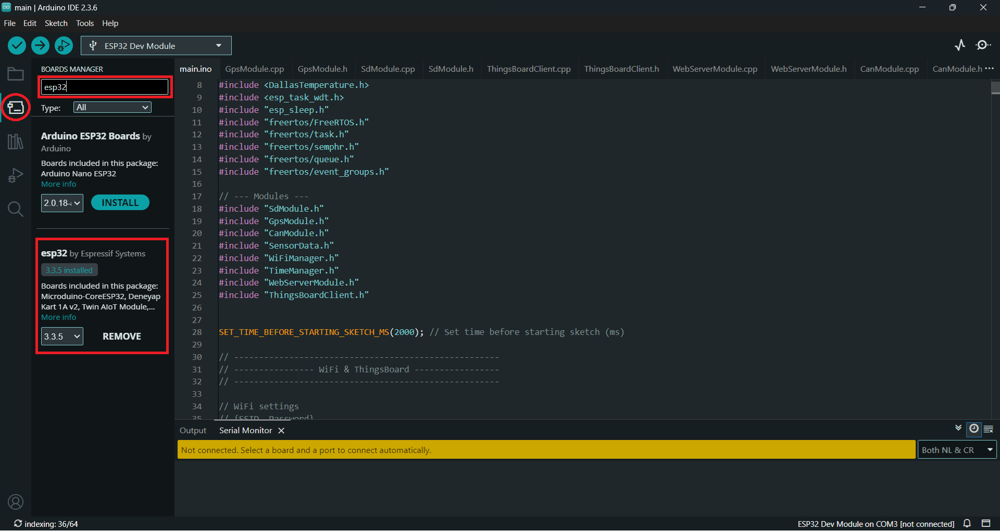
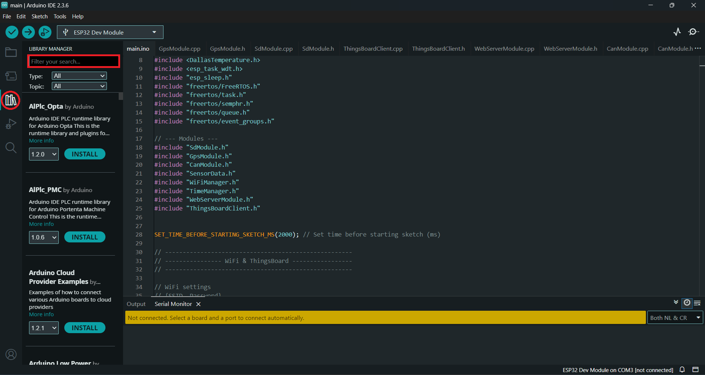
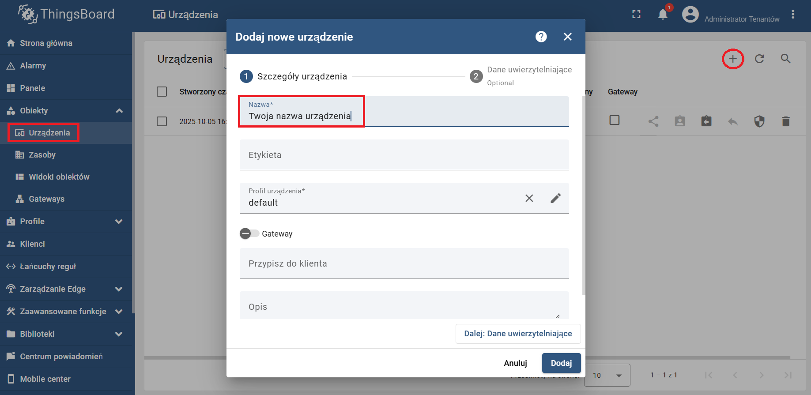
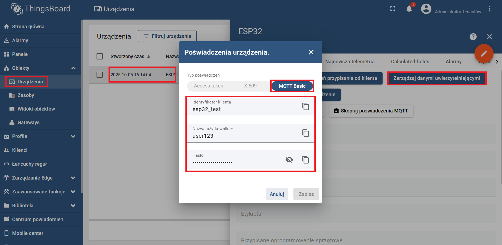
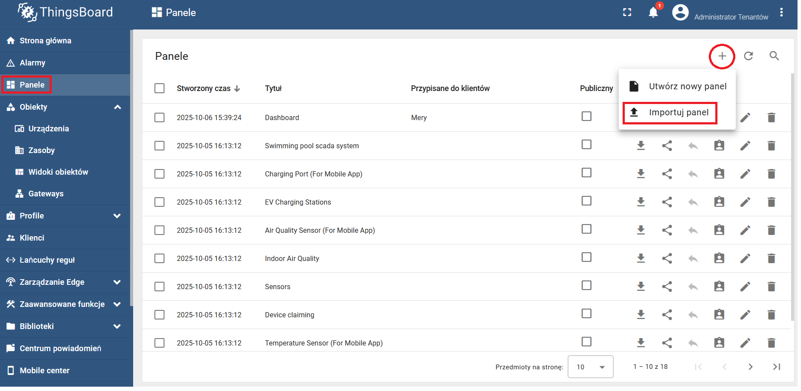
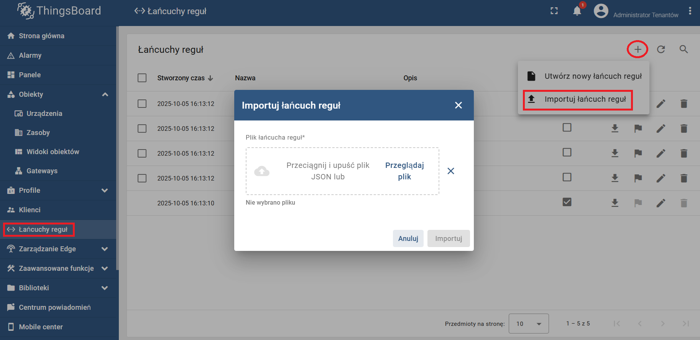
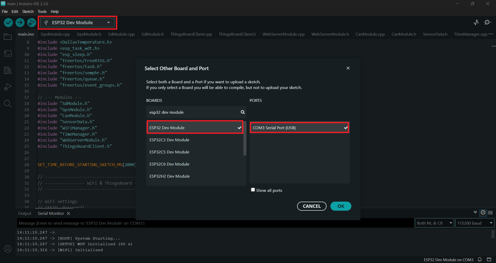
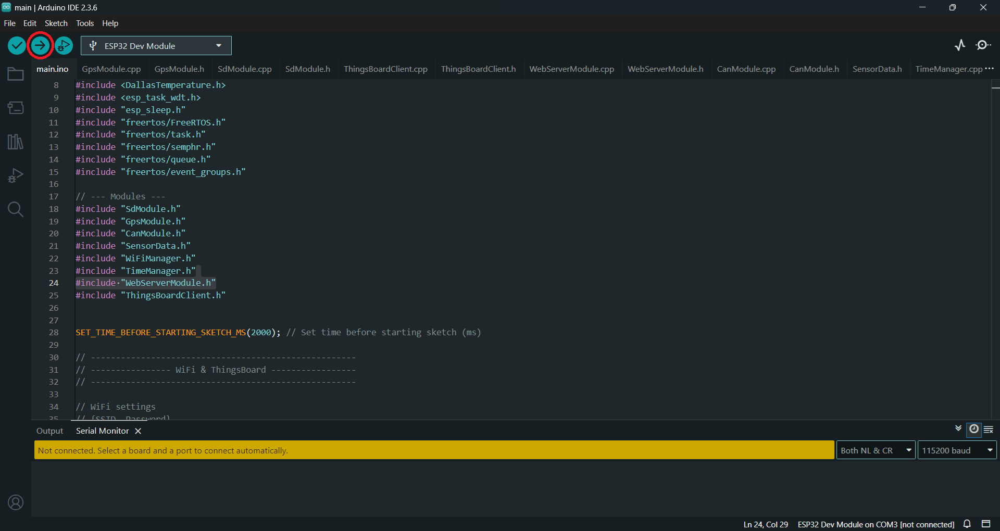

# Instrukcja konfiguracji systemu

## Spis treści
1. [Wymagania sprzętowe](#1-wymagania-sprzętowe)
2. [Instalacja oprogramowania](#2-instalacja-oprogramowania)
3. [Konfiguracja](#3-konfiguracja)
4. [Uruchomienie](#4-uruchomienie)

---

## 1. Wymagania sprzętowe

Szczegółowa instrukcja montażu i lista części (BOM) znajduje się w pliku: [📂 hardware/HARDWARE_MANUAL.md](hardware/HARDWARE_MANUAL.md).

**Kluczowe komponenty:**
1.  **Mikrokontroler:** ESP32-DevKitC V4.
2.  **GPS:** Moduł Quectel LC76G (UART).
3.  **CAN:** Transceiver TJA1051T/3.
4.  **Pamięć:** Moduł czytnika microSD + Karta 32GB (FAT32).
5.  **Czujniki:** DS18B20 (Temperatura).
6.  **Zasilanie:** Przetwornica Step-Down (12V->5V) 
7.  **Akumulator:** Ogniwo 18650 (Li-Ion).

---

## 2. Instalacja oprogramowania

Projekt wymaga środowiska **Arduino IDE** (wersja 2.3.6 lub nowsza) ze wsparciem dla płytek ESP32.

1. Instalacja obsługi ESP32
Przejdź do zakładki `Menedżer płytek (ang. Board Manager)`, wyszukaj "esp32" i zainstaluj (wersja od Espressif Systems).
 

2. Instalacja wymaganych bibliotek
Zainstaluj poniższe biblioteki poprzez Menedżer Bibliotek (`Menedżer bibliotek ang.(Library Manager)`):

| Biblioteka | Autor | Wersja (Testowana) |
| :--- | :--- | :--- |
| **TinyGPSPlus** | Mikal Hart | 1.0.3 |
| **ArduinoJson** | Benoit Blanchon | 7.4.2 |
| **PubSubClient** | Nick O'Leary | 2.8 |
| **DallasTemperature** | Miles Burton | 4.0.5 |
| **OneWire** | Jim Studt | 2.3.8 |



---

## 3. Konfiguracja

Przed wgraniem kodu należy uzupełnić dane logowania w pliku `main/main.ino`.

1.  Otwórz plik `main/main.ino`.
2.  Znajdź sekcję **WiFi settings** (linia ~32) i wpisz dane swojej sieci (możesz dodać więcej niż jedną sieć do tablicy):
    ```cpp
    std::vector<WiFiConfig> WIFI_CONFIG = {
        {"TWOJE_SSID", "TWOJE_HASLO"},   // <--- Edytuj tutaj
        {"Zapasowe_WiFi", "haslo123"}
    };
    ```
3.  Znajdź sekcję **ThingsBoard settings** (linia ~39) i wpisz dane serwera (Pokazane w sekcji "Przygotowanie ThingsBoard"):
    ```cpp
    const char* MQTT_CLIENT_ID = "esp32_test";              //<--- Edytuj tutaj (Client id z ThingsBoard) 
    const char* MQTT_USERNAME  = "user123";                 //<--- Edytuj tutaj (Username z ThingsBoard) 
    const char* MQTT_PASSWORD  = "8erz5sxd48lm797nr4ch";    //<--- Edytuj tutaj (Password z ThingsBoard)
    ```
---

### Przygotowanie ThingsBoard
Aby wizualizacja działała od razu, zaimportuj gotową konfigurację:
1.  Zaloguj się do [ThingsBoard](https://demo.thingsboard.io/).
2.  Stwórz nowe urządzenie ("Device").
3.  Skopiuj dane uwierzytelniające 
4.  Przejdź do zakładki **Dashboards**, Kliknij `+` -> `Import dashboard` i wybierz plik: `thingsBoard/dashboard.json`.
5.  Przejdź do zakładki **Rule chains**, Kliknij `+` -> `Import rule chain` i wybierz plik: `thingsBoard/root_rule_chain.json`.

---

## 4. Uruchomienie

### Wgrywanie kodu
1.  Podłącz ESP32 do komputera przez USB.
2.  Wybierz płytkę: `Narzędzia` -> `Płytka` -> `ESP32 Dev Module`.
3.  Wybierz port COM, pod którym wykryto płytkę (nie musi to być COM3).

4.  Kliknij przycisk **Wgraj** (strzałka w prawo).


---

## Autor
**Miłosz Stec** Inżynieria Mechatroniczna, AGH Kraków  
Rok: 2026