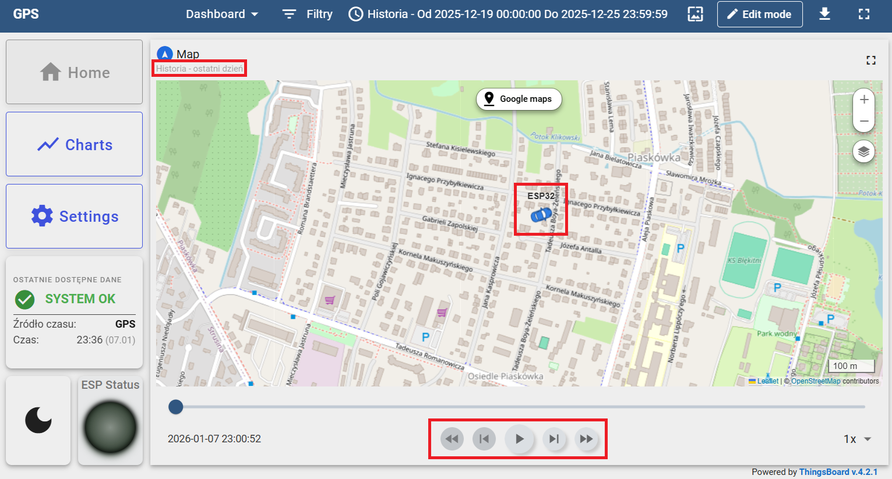
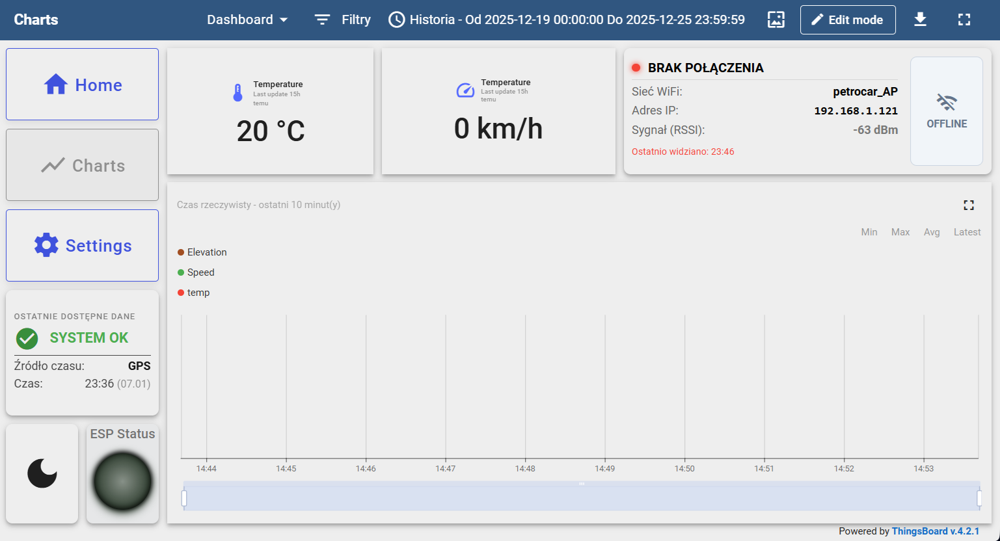
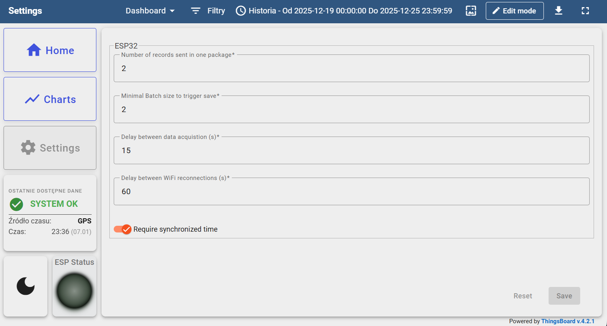

# Instrukcja Użytkownika Systemu Lokalizacji Pojazdu

Niniejszy dokument opisuje sposób codziennego użytkowania urządzenia lokalizacyjnego, interpretację sygnalizacji świetlnej oraz obsługę panelu internetowego.

---

## Spis treści

- [Instrukcja Użytkownika Systemu Lokalizacji Pojazdu](#instrukcja-użytkownika-systemu-lokalizacji-pojazdu)
  - [Spis treści](#spis-treści)
  - [1. Uruchomienie i Zasilanie](#1-uruchomienie-i-zasilanie)
    - [Zasilanie awaryjne (UPS)](#zasilanie-awaryjne-ups)
  - [2. Sygnalizacja LED (Co oznaczają diody?)](#2-sygnalizacja-led-co-oznaczają-diody)
  - [3. Przełącznik zasilania](#3-przełącznik-zasilania)
  - [4. Obsługa Panelu Online (ThingsBoard)](#4-obsługa-panelu-online-thingsboard)
    - [Widok Mapy (Home / Map)](#widok-mapy-home--map)
    - [Wykresy i Parametry (Charts)](#wykresy-i-parametry-charts)
    - [Ustawienia (Settings)](#ustawienia-settings)
  - [5. Praca w trybie Offline](#5-praca-w-trybie-offline)
  - [6. Rozwiązywanie problemów](#6-rozwiązywanie-problemów)

---

## 1. Uruchomienie i Zasilanie

Urządzenie jest zaprojektowane jako **bezobsługowe**.

1.  **Montaż:** Umieść urządzenie w pojeździe w miejscu, które nie zasłania widoku nieba metalowymi elementami (np. na podszybiu lub desce rozdzielczej). Jest to kluczowe dla zasięgu GPS.
2.  **Zasilanie:** Podłącz urządzenie do źródła prądu:
    * **W pojeździe:** Do portu OBD2.
    * **Stacjonarnie:** Do dowolnej ładowarki USB-C (np. od telefonu).
    * **Akumulatorowo:** Włóż akumulator do urządzenia.
    > **Uwaga:** Nie wolno podłączać jednocześnie USB-C oraz portu OBD2. Grozi to uszkodzeniem urządzenia.
3.  **Start:** Urządzenie uruchomi się po włączeniu przełącznika zasilania.

### Zasilanie awaryjne (UPS)
Urządzenie posiada wbudowany akumulator. Po wyłączeniu zapłonu w samochodzie, lokalizator będzie kontynuował pracę przez pewien czas (zależny od poziomu naładowania).

---

## 2. Sygnalizacja LED (Co oznaczają diody?)

Na obudowie znajdują się trzy diody informujące o aktualnym stanie urządzenia.

| Dioda (Kolor)          | Stan       | Oznaczenie             | Co robić?                                                                     |
| :--------------------- | :--------- | :--------------------- | :---------------------------------------------------------------------------- |
| **🔵 WiFi** (Niebieska) | **Świeci** | **Połączono (Online)** | System działa poprawnie, dane są wysyłane na żywo.                            |
|                        | Zgaszona   | Brak sieci (Offline)   | To normalne w trasie. Dane zapisują się na karcie SD.                         |
| **🟢 GPS** (Zielona)    | **Świeci** | **Pozycja ustalona**   | Lokalizacja jest precyzyjna.                                                  |
|                        | Zgaszona   | Szukanie satelitów     | Poczekaj chwilę. W garażach podziemnych /tunelach brak sygnału jest normalny. |
| **🔴 SD** (Czerwona)    | **Świeci** | **Karta OK**           | Wszystko w porządku, system plików działa.                                    |
|                        | Zgaszona   | Błąd Karty!            | Wyjmij i włóż kartę SD ponownie. Jeśli nie pomaga, wymień kartę.              |

---

## 3. Przełącznik zasilania

Urządzenie wyposażone jest w jeden przełącznik zasilania, który wyłącza urządzenie.

## 4. Obsługa Panelu Online (ThingsBoard)

Dostęp do danych lokalizacyjnych możliwy jest przez przeglądarkę internetową (na komputerze lub telefonie).

### Widok Mapy (Home / Map)
Główny ekran systemu.
* **Znacznik:** Pokazuje ostatnią znaną pozycję pojazdu.
* **Linia:** Rysuje przebytą trasę.
* **Historia:** Użyj suwaka czasu na dole ekranu lub kalendarza w prawym górnym rogu, aby zobaczyć, gdzie pojazd był wczoraj lub tydzień temu.

### Wykresy i Parametry (Charts)
Tutaj znajdziesz szczegółowe dane telemetryczne:
* **Prędkość:** Aktualna prędkość pojazdu (km/h).
* **Temperatura:** Odczyt z czujnika temperatury.
* **Siła Sygnału (RSSI):** Informuje o jakości połączenia z siecią WiFi.

### Ustawienia (Settings)
W tej zakładce możesz zdalnie zmieniać parametry pracy urządzenia bez konieczności podłączania go do komputera.

* **Interwał zapisu (Delay):** Określa, co ile sekund urządzenie pobiera pozycję.
    * *Mniejsza wartość (np. 5s)* = Bardziej dokładna trasa, ale szybsze zużycie baterii/danych.
    * *Większa wartość (np. 60s)* = Oszczędność energii.
* **Rozmiar paczki (Batch Size):** Ile pomiarów jest wysyłanych naraz.

> **Uwaga:** Zmiana ustawień zostanie wprowadzona w urządzeniu przy następnym połączeniu z serwerem.

---

## 5. Praca w trybie Offline

System jest odporny na zaniki zasięgu WiFi.
1.  Gdy dioda **WiFi (Niebieska)** zgaśnie, urządzenie przechodzi w tryb rejestratora.
2.  Wszystkie dane (trasa, prędkość) są zapisywane na karcie pamięci (bufor).
3.  Po powrocie w zasięg znanej sieci WiFi, urządzenie automatycznie "dosyła" zaległe dane.
4.  Historia trasy na mapie uzupełni się automatycznie.

---

## 6. Rozwiązywanie problemów

**Problem:** Urządzenie nie wysyła danych, świeci tylko czerwona i zielona dioda.
* **Rozwiązanie:** Urządzenie jest poza zasięgiem skonfigurowanej sieci WiFi. To normalne zachowanie. Dane zostaną wysłane po powrocie do bazy/domu.

**Problem:** Dioda GPS (Zielona) nie chce się zaświecić.
* **Rozwiązanie:** Upewnij się, że urządzenie "widzi" niebo. Sygnał GPS nie przenika przez betonowe stropy garaży czy gęste zadaszenia. Pierwsze ustalenie pozycji po długim wyłączeniu (Cold Start) może potrwać do 1 minut.

**Problem:** Dioda SD (Czerwona) zgasła.
* **Rozwiązanie:** Awaria zapisu. Sprawdź, czy karta microSD jest włożona poprawnie. Jeśli tak, sformatuj ją w komputerze (system plików FAT32) i włóż ponownie.